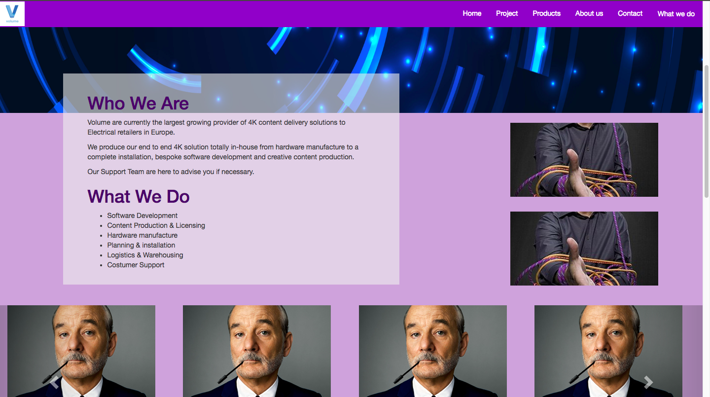

# sparta bootstrap pagecopy

## Description
The aim of this homework is to recreate the Volume network [**homepage**](https://volumenetwork.com/) and style it so it looks as close to the original as possible (apart from a palette change).



## Author
David James

## Tech used
- git
- atom
- live-server
- bootstrap
- html
- css
- macdown

## Challenges
I didn't have much issue with this homework. The only problem I had, was with the padding of the support button in the footer.
## Takeaway
Overall this homework was a alot less painful than I initally thought it was going to be. I believe I am starting to understand how to override bootstrap css classes.  

I would give this homework a 7/10.
## Link to github & pages
[Live page](https://davidsijames.github.io/sparta_bootstrap_pagecopy/)

[GitHub page](https://github.com/DavidSIJames)
## Instructions on how to download
1. if you do not have git installed follow this [guide](https://gist.github.com/derhuerst/1b15ff4652a867391f03)
2. In your browser, navigate to this [page](https://github.com/DavidSIJames/sparta_bootstrap_pagecopy)
3. Open your Terminal and navigate to where you want to clone the repo.
4. Once there, enter the following command to clone the repo:

	```terminal
	git clone git@github.com:DavidSIJames/sparta_bootstrap_pagecopy.git
	```
5. once the repo has been cloned, cd into it using this command

	```terminal
	cd sparta_bootstrap_pagecopy
	```
6. you are now in the repo
